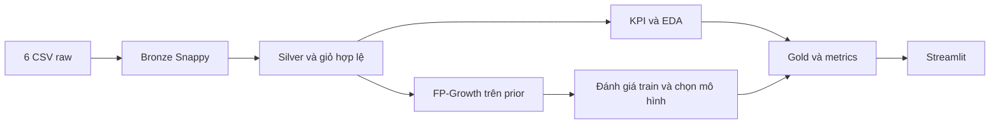

# Instacart Prototype

Prototype đồ án Big Data: phân tích hành vi mua sắm và gợi ý sản phẩm mua kèm trên Instacart thật. Công nghệ: Python, Apache Spark/PySpark, Spark SQL/DataFrame, MLlib FP-Growth, Streamlit, PyArrow, Pandas, Matplotlib và Plotly.

## Trạng thái sau khi rà file chuẩn bị push

Lần rà hiện tại xác nhận code/config/tests còn đầy đủ. Một số tài liệu đã được nhắc trong lịch sử không còn trên đĩa: Chương 5 Markdown, Word/PDF hoàn thiện, thư mục docs/reference, các task report và src/doc. Chúng đã thiếu trước lần dọn này; Agent không xóa các báo cáo đó. Số liệu nghiệm thu cũ vẫn được giữ làm lịch sử, không coi là xác nhận bộ tài liệu hiện tại đầy đủ. Các ảnh bằng chứng và trang PDF đã raster vẫn còn trong outputs/evidence.

Các lệnh build_report/render_report chưa chạy lại được khi thiếu Word tham chiếu; cần phục hồi bản gốc trước nếu muốn tái tạo báo cáo. .git xuất hiện như thư mục rỗng do môi trường truy cập, không có repository/history; thao tác xóa bị mount bảo vệ, thử ngoài sandbox không thấy thư mục này. Không có căn cứ kết luận Agent đã tạo metadata Git thật. Chủ dự án khởi tạo Git trong terminal local để chuẩn bị lần push đầu tiên.

Xem [báo cáo dọn file hiện tại](docs/CLEANUP_REPORT.md) và [danh sách file dự kiến public](docs/PUBLISH_FILES.txt). File local bị ignore vẫn được giữ nếu phục vụ chạy project/provenance; clone mới cần raw và pipeline như hướng dẫn setup.

## Bắt đầu cho thành viên mới

Đọc [hướng dẫn cài đặt](docs/SETUP_GUIDE.md), [workflow nhóm](docs/TEAM_WORKFLOW.md), [quy tắc Agent](AGENTS.md) và [báo cáo chuẩn bị GitHub](docs/GITHUB_READINESS_REPORT.md). Các lệnh chạy từ thư mục gốc; URL repository chưa được xác minh nên lấy URL thật từ nhóm.

```bash
git clone <REPOSITORY_URL> instacart-prototype
cd instacart-prototype
java -version
python3 --version
python3 -m venv .venv
source .venv/bin/activate
python -m pip install -r requirements.txt
python -m pip check
```

Môi trường đã xác minh: Python 3.14.4, Java 17, PySpark 4.2.0, Streamlit 1.64.0. `requirements.txt` là file chính; `requirements-lock.txt` ghi đúng môi trường hiện có. Chưa thử cài sạch trên máy khác; không tự nâng cấp các phiên bản ghim. Project không yêu cầu `.env`: cấu hình ở hai YAML trong `config/`.

Đặt sáu CSV thật vào `data/raw/`: `aisles.csv`, `departments.csv`, `products.csv`, `orders.csv`, `order_products__prior.csv`, `order_products__train.csv`. Không đi kèm dataset trong GitHub, không tạo dữ liệu giả. Kiểm tra đầu vào nhẹ:

```bash
python -c "import sys; sys.path.insert(0, 'src'); from pipeline.raw_validation import inspect_files; print(inspect_files('data/raw'))"
```

Chọn **một** chế độ pipeline phù hợp; cả hai đều xử lý dữ liệu thật, không phải lệnh test nhanh:

```bash
# Mẫu 1% trong workspace riêng; phù hợp bắt đầu trên máy hạn chế RAM
bash run_pipeline.sh --mode sample --sample-fraction 0.01
# Full: xử lý mới nếu chưa có đầu ra, hoặc xác minh/resume nếu đã hoàn thành
bash run_pipeline.sh --mode full --resume
```

Dashboard full cần Gold và metrics tương ứng, không chạy được chỉ bằng các ảnh snapshot trong repo:

```bash
python -m streamlit run app/dashboard.py --server.port 8501
```

Mở <http://127.0.0.1:8501>, dừng bằng Ctrl+C. Với sample dùng app trong `outputs/sample_runs/<run_id>/app/` như hướng dẫn setup. Test nhẹ không cần dataset và test đầy đủ sau khi có dữ liệu:

```bash
python -m unittest discover -s tests -p test_pipeline_runner.py -v
python -m unittest discover -s tests -v
```

## Kiến trúc và kết quả đã có

Luồng khái quát CSV → Bronze → Silver → Gold → Analytics/FP-Growth → Dashboard. Thứ tự thực thi chi tiết: Silver phục vụ Analytics/FP-Growth, hai nhánh ghi Gold; dashboard đọc Gold/metrics đã lưu. Spark SQL thể hiện qua DataFrame aggregations, joins, window ranking và SQL expression percentile; không có script SQL độc lập.

Đã hoàn thành validation/DQ sáu CSV, Bronze Snappy có metadata, Silver/FK/baskets, KPI/EDA, FP-Growth/grid/evaluation, Gold, dashboard năm trang và bằng chứng trình duyệt. Snapshot full: 3.421.083 orders, 33.819.106 order-items, 206.209 users, trung bình giỏ 10,107 và reorder 59,006%. Model support 0,001/confidence 0,2 có 4.172 itemsets, 834 rules, Coverage 73,250%, HitRate@5 14,474%; đây là validation nội bộ. Có 12 biểu đồ đánh số, 18 ảnh bằng chứng và Word/PDF 15 trang. Lịch sử nghiệm thu 34 test full PASS, mẫu 1% raw→Gold có 32 test PASS tại snapshot; lần rà tài liệu chỉ chạy test nhẹ, không huấn luyện lại.

Xem [nghiệm thu](docs/PROTOTYPE_COMPLETION_REPORT.md), Chương 5 (bản lịch sử hiện không có trong workspace), [manifest ảnh](outputs/evidence/EVIDENCE_MANIFEST.md), Word (bản lịch sử hiện không có trong workspace), PDF (bản lịch sử hiện không có trong workspace). Sơ đồ và diễn giải chi tiết từng task phía dưới được giữ lại để tra cứu; số test/thời điểm cũ là lịch sử, không phải kết quả chạy mới.

## Phạm vi chia sẻ GitHub

Giữ source/YAML an toàn, docs, `.gitkeep`, README dataset, PNG/HTML biểu đồ, PNG/manifest evidence và CSV aggregate đã rà. Bỏ qua `.venv`, dataset và Parquet cả Gold, staging/checkpoints/backups, logs, caches, `.env`/secrets, cấu hình tài khoản, sample runs, công cụ LibreOffice và metrics JSON runtime chứa đường dẫn máy. Không bỏ qua toàn bộ outputs. `.gitignore` không bỏ theo dõi file đã track; kiểm tra staged diff trước push. Các báo cáo/task lịch sử vẫn có đường dẫn máy: xem báo cáo readiness, rà trước công bố, không tự sửa bằng chứng.

Hạn chế: local Spark chưa HDFS/cluster; support 0,0005 chưa có kết quả đầy đủ; train dùng chọn mô hình nên chưa có test độc lập; fingerprint không hash toàn CSV; chưa CI; chưa xác minh clean install/remote Git. Troubleshooting Java, missing module/dataset, OOM và port có trong [setup](docs/SETUP_GUIDE.md).

## Bản đồ thành phần bổ sung

```text
run_pipeline.sh              Entry point shell Linux/WSL
src/run_pipeline.py          Orchestrator và verified resume
src/prototype_checks.py      Kiểm tra artifact thật
src/evidence/                Sample, screenshots, supplement, Word/PDF
app/dashboard.py            Entry point Streamlit
app/data_loader.py           Đọc/cache Gold và metrics
app/recommender.py           Khớp antecedent và Top-5/fallback
config/model_config.yaml     Grid/caps/tuning FP-Growth
.streamlit/config.toml       Theme, headless và telemetry
requirements.txt             Dependencies chính thức
requirements-lock.txt        Snapshot venv đã kiểm tra
AGENTS.md                    Quy tắc Agent
```

Phân tích hành vi mua sắm và gợi ý sản phẩm mua kèm bằng Apache Spark và FP-Growth.

## Cấu trúc

```text
app/                 Dashboard
config/settings.yaml Cấu hình Spark
data/raw/            Dữ liệu gốc
data/bronze/          Dữ liệu Bronze
data/silver/          Dữ liệu Silver
data/gold/            Dữ liệu Gold
docs/                Tài liệu và báo cáo
logs/                Log thực thi
notebooks/           Notebook khám phá
outputs/figures/     Biểu đồ
outputs/metrics/     Kết quả đánh giá
src/common/          SparkSession và logger dùng chung
src/pipeline/        Pipeline xử lý
src/doc/             Tài liệu task hiện có
src/test_spark.py    Kiểm thử Spark với 1.000.000 dòng tổng hợp
tests/               Kiểm thử bổ sung
```

## Chạy kiểm thử

Môi trường hiện có: Python 3.14, Java 17, PySpark 4.2.0 trong `.venv`.
Giữ nguyên danh sách phiên bản trong `requirements.txt`. Khi tạo môi trường mới:

```bash
python3 -m venv .venv
.venv/bin/python -m pip install -r requirements.txt
```

Từ thư mục gốc project:

```bash
.venv/bin/python src/test_spark.py
```

Cấu hình trong `config/settings.yaml`: `local[*]`, driver memory `2g`, adaptive
query execution `true`, shuffle partitions `32`, log level `WARN`.
Số partition của `spark.range` phụ thuộc số CPU, không nhất thiết bằng shuffle partitions.
Kiểm thử kiểm tra số dòng và cấu hình, in kết quả, luôn dừng Spark trong `finally` và
không chờ nhập liệu. Log ứng dụng nằm tại `logs/project.log`.
Task 1 không xử lý dataset. Báo cáo thực tế: `docs/task_01_report.md`.

## Task 2: kiểm tra raw và tạo Bronze

```bash
.venv/bin/python src/pipeline/01_validate_raw.py
.venv/bin/python src/pipeline/02_ingest_bronze.py
.venv/bin/python -m unittest discover -s tests -p 'test_raw_validation.py' -v
```

Lệnh ingestion tự kiểm tra lại cả sáu file trước khi ghi. Schema được khai báo tại
`src/pipeline/raw_validation.py`. CSV dùng dấu nháy kép để escape, đọc FAILFAST,
không bỏ dòng lỗi. Giữ nguyên các cột nguồn và thêm `ingestion_time`, `source_file`.
Kiểm tra null, khóa trùng và miền giá trị; `days_since_prior_order` được phép null
chỉ với đơn đầu tiên. Không dùng `collect()` hoặc `toPandas()` trên dữ liệu nguồn.

Bronze được ghi vào staging, đọc lại để kiểm tra số dòng, schema, metadata và
compression Snappy trước khi chuyển sang `data/bronze/<table_name>`. Sau đó đọc
lại cả sáu đường dẫn cuối để đối soát. Nếu đường dẫn Bronze đã tồn tại, pipeline
dừng để tránh ghi đè. Staging của lần ghi lỗi được giữ lại để kiểm tra.

Kết quả: `outputs/metrics/raw_profile.json`, `outputs/metrics/raw_profile.csv`,
`logs/bronze_pipeline.log`; báo cáo tổng kết: `docs/task_02_report.md`.
Lệnh validation độc lập sẽ thay báo cáo metrics bằng kết quả validation mới.

## Task 3: Silver, KPI và EDA

```bash
.venv/bin/python src/pipeline/03_build_thưsilver.py
.venv/bin/python src/pipeline/04_eda.py
.venv/bin/python -m unittest discover -s tests -p 'test_silver_eda.py' -v
```

Tên script Silver giữ đúng tên trong tài liệu Task 3. Cả hai pipeline chỉ đọc
Parquet đã có, không đọc lại CSV raw. Silver gồm orders, products (kèm aisle và
department), order_items (prior + train), order_items_enriched và baskets.
Validation kiểm tra null, miền giá trị, duplicate, khóa ngoại và eval_set.
Giỏ chỉ chứa đơn có sản phẩm quan sát được; không tạo giỏ rỗng cho các đơn test.

KPI tổng đơn/người dùng tính trên tất cả orders; KPI giỏ và reorder tính trên
prior + train. Trung vị giỏ là percentile chính xác; trung bình khoảng cách
mua bỏ null và phản ánh giá trị nguồn bị giới hạn ở 30 ngày. Mã ngày 0–6
không được gán tên Thứ Hai/Chủ nhật khi chưa có thông tin ánh xạ.

KPI Parquet: `data/gold/kpi_summary`. Báo cáo JSON/CSV và CSV sau mỗi biểu đồ
nằm tại `outputs/metrics`; 6 PNG và 6 HTML độc lập nằm tại `outputs/figures`.
Matplotlib tạo PNG, Plotly tạo HTML; chỉ bảng aggregate tối đa 500 dòng được
chuyển sang Pandas. Log stage: `logs/eda_pipeline.log`.
Báo cáo thực tế: `docs/task_03_report.md`. Pipeline từ chối ghi đè bảng đã tồn tại.

## Task 4: FP-Growth và đánh giá

```bash
.venv/bin/python src/pipeline/05_train_fpgrowth.py
.venv/bin/python src/pipeline/06_evaluate_rules.py
.venv/bin/python -m unittest discover -s tests -p 'test_fpgrowth.py' -v
```

Cấu hình: `config/model_config.yaml`. Model chỉ học từ giỏ prior có ít nhất hai
sản phẩm, dùng ArrayType(IntegerType), không học trên train hoặc tên sản phẩm.
Mỗi mức support học một lần; cùng frequent itemset được tái sử dụng cho ba
mức confidence (confidence không thay đổi bước tìm frequent pattern).
Worker chạy trong process group riêng; timeout/OOM hoặc giới hạn số itemset/luật
sẽ dừng worker và ghi trạng thái rõ ràng, tiếp tục các support khác.
Task 4 dùng driver 3g và 128 phân vùng nhỏ, hạn chế task đồng thời; cấu hình chung vẫn giữ 2g.

Đánh giá dùng giỏ prior cuối của mỗi người dùng có đơn train làm ngữ cảnh,
sản phẩm trong đơn train làm ground truth. Khớp toàn bộ antecedent, không gợi ý
sản phẩm đã nằm trong giỏ ngữ cảnh, chỉ giữ consequent một sản phẩm. Xếp tối đa
5 sản phẩm khác nhau theo confidence, lift, support. Coverage là phần người
dùng được gợi ý; HitRate@5 là phần người dùng có ít nhất một gợi ý đúng, tính
cả người không được gợi ý trong mẫu số. Tập train đồng thời dùng để chọn cấu
hình nên đây là validation nội bộ, không phải đánh giá test độc lập.

`recommendation_lookup` là chỉ mục theo từng sản phẩm antecedent; cần khớp đủ
`antecedent_size` sản phẩm của một `rule_id`, không áp dụng từng seed như luật
một sản phẩm. Names chỉ được thêm lúc xuất cuối. Các bảng Gold là Snappy Parquet.

Báo cáo: `outputs/metrics/model_summary.json`, `model_comparison.csv`,
`docs/task_04_report.md`. Log stage: `logs/fpgrowth_pipeline.log`; log từng worker
được giữ riêng. Biểu đồ và CSV kiểm chứng có tiền tố `model_` trong outputs.
Thời gian fit được dùng chung cho ba confidence của một support, không cộng
lặp ba lần. Pipeline từ chối ghi đè các bảng Gold cuối đã tồn tại.

Nếu phải dừng run do thiếu bộ nhớ, có thể tiếp tục với tập training đã kiểm tra:

```bash
.venv/bin/python src/pipeline/05_train_fpgrowth.py --resume-run data/gold/.fpgrowth_run_<run_id>
```

Run resume giữ nguyên support đã PASS; artifact lỗi được đổi tên và giữ lại. Support 0,0005 được bỏ qua nếu worker log của các lần thử trong project đã xác nhận OutOfMemoryError/Java heap space. Resume dừng worker và orchestrator cũ của đúng run để tránh chạy trùng.

Để một run dài tiếp tục chạy khi tương tác trong chat, dùng chế độ nền:

```bash
.venv/bin/python src/pipeline/05_train_fpgrowth.py --resume-run data/gold/.fpgrowth_run_<run_id> --background --finish-task
```

Chế độ này giữ các support đã PASS, tự chạy đánh giá và unit test sau huấn luyện.
Theo dõi `logs/fpgrowth_job_status.json` và `logs/fpgrowth_background.log`.

## Task 5: Dashboard Streamlit

Dashboard **Instacart Basket Intelligence** có năm trang: Tổng quan, Hành vi mua sắm, Luật kết hợp, Gợi ý sản phẩm và Hiệu năng hệ thống.

Chuẩn bị danh mục sản phẩm nhỏ cho dashboard sau khi Silver đã hoàn tất (một lần, không chạy lại Spark pipeline):

```bash
.venv/bin/python app/prepare_dashboard_data.py
```

Chạy từ thư mục project:

```bash
.venv/bin/python -m streamlit run app/dashboard.py --server.address 127.0.0.1 --server.port 8501 --server.headless true --browser.gatherUsageStats false
```

Mở <http://127.0.0.1:8501>. Dashboard chỉ đọc Gold và metrics đã lưu, cache theo dấu thời gian/kích thước file. Nút **Làm mới dữ liệu** xóa cache. Thiếu dữ liệu sẽ hiển thị đường dẫn và pipeline cần chạy; ứng dụng không tự chạy pipeline.

Gợi ý khớp toàn bộ antecedent, loại sản phẩm trong giỏ, xếp theo confidence/lift/support và giữ tối đa năm sản phẩm duy nhất. Nếu không có luật, fallback dùng top 20 sản phẩm phổ biến đã tính ở Task 3, ghi rõ nguồn và không tạo confidence/lift giả. Nếu danh sách khả dụng ít hơn năm sản phẩm, kết quả có thể ngắn hơn Top-5. Bộ lọc luật chỉ lọc mô hình Gold đã chọn, không huấn luyện lại hay phục hồi luật chưa lưu.

Kiểm tra trên dữ liệu thật và các trang Streamlit:

```bash
.venv/bin/python -m unittest discover -s tests -p test_dashboard.py -v
```

Báo cáo chi tiết: docs/task_05_report.md (bản lịch sử hiện không có trong workspace).

## Tích hợp prototype (Task 6)

Đề tài xây dựng prototype phân tích giỏ hàng và gợi ý sản phẩm mua kèm từ Instacart bằng Spark MLlib FP-Growth; trình bày kết quả qua Streamlit. Luật được học từ lịch sử prior, đánh giá nội bộ bằng đơn train.



Dataset phải nằm ở `data/raw`; tên được cấu hình chính xác trong `src/pipeline/raw_validation.py`: `aisles.csv`, `departments.csv`, `products.csv`, `orders.csv`, `order_products__prior.csv`, `order_products__train.csv`. Hai file order_products hiện dùng **hai dấu gạch dưới** trước prior/train. Không tự tải hay tạo dữ liệu giả. `requirements.txt` ghi phiên bản môi trường hiện có; cần Java 17 và đủ bộ nhớ cho Spark, đặc biệt FP-Growth.

Runner tích hợp:

```bash
chmod +x run_pipeline.sh
./run_pipeline.sh
# Mặc định resume; có thể ghi rõ:
./run_pipeline.sh --resume
```

Thứ tự: validation raw → Bronze → Silver → KPI/EDA → FP-Growth → đánh giá và xuất mô hình → kiểm tra Gold → dữ liệu dashboard → toàn bộ test. Mỗi stage ghi timestamp/thời gian, số dòng theo bảng, trạng thái và log. `RESUMED` nghĩa là kiểm tra lại báo cáo PASS, row count/schema/Snappy và mẫu đọc artifact rồi bỏ qua xử lý đã hoàn tất; giây ghi trong stage là thời gian xác minh hiện tại. Các bảng Gold nhỏ được decode đầy đủ. Tests luôn chạy lại. Lock ngăn hai runner đồng thời; subprocess lỗi dừng chuỗi và truyền exception, không giấu traceback. `--no-resume` chỉ dùng workspace sạch; runner không xóa hoặc ghi đè đầu ra cũ.

Fingerprint kiểm tra tên/kích thước/mtime raw và nội dung YAML cấu hình; đổi raw/config sau checkpoint sẽ dừng resume để tránh dùng đầu ra không còn phù hợp. Đây chưa phải hash toàn bộ nội dung CSV. Không sửa trạng thái FAIL thành PASS bằng tay. Đầu ra không hoàn chỉnh cần xem log và khôi phục artifact/checkpoint, hoặc chạy trong workspace sạch.

File bổ sung:

```text
run_pipeline.sh                  Entry point shell
src/run_pipeline.py              Orchestrator và audit stage
src/prototype_checks.py          Kiểm tra artifact và đối soát
src/write_chapter5.py             Tổng hợp Chương 5 từ metrics thật
outputs/metrics/prototype_summary.json
outputs/metrics/experiment_environment.json
logs/integrated_pipeline.log
logs/integrated_<stage>.log
docs/CHUONG_5_THUC_NGHIEM.md
docs/DEMO_CHECKLIST.md
```

Đọc kết quả: `prototype_summary.json` lưu lần chạy tích hợp hiện tại và số dòng Gold; `raw_profile.json` là đối soát CSV/Bronze; `silver_profile.json` ghi khóa ngoại/giỏ; `eda_summary.json` chứa KPI; `model_comparison.csv` ghi đủ 9 tổ hợp, ô thiếu của cấu hình SKIPPED không phải 0; `model_summary.json` giải thích mẫu số, cách chọn mô hình và thời gian. PNG phục vụ báo cáo; HTML Plotly tương tác và CSV tương ứng phục vụ kiểm chứng. Chương 5 dùng liên kết tương đối đến đúng hình. Cập nhật chương sau một lần runner PASS bằng `.venv/bin/python src/write_chapter5.py`.

Chạy riêng toàn bộ test:

```bash
.venv/bin/python -m unittest discover -s tests -v
```

Hạn chế: validation nội bộ dùng train để chọn cấu hình, chưa có test cuối độc lập/baseline; support 0,0005 chưa có kết quả hoàn chỉnh do RAM và gián đoạn; không đánh giá end-to-end mới từ raw trong Task 6 mà xác minh/resume đầu ra có thật. Dashboard fallback giới hạn top 20 và chưa có deploy/authentication. Kiểm tra giao diện dùng AppTest, cần bổ sung kiểm tra trình duyệt đa thiết bị. Chi tiết trong Chương 5 (bản lịch sử hiện không có trong workspace) và [checklist demo 6 phút](docs/DEMO_CHECKLIST.md).

## Bản hoàn thiện và bằng chứng thực nghiệm

Báo cáo mới: `docs/Bao_cao_prototype_hoan_thien.docx`; bản tham chiếu giữ nguyên tại `docs/reference/Bao_cao_prototype_Big_Data_Instacart.docx` và file gốc trong `src/doc`. Bản PDF kiểm tra nằm cạnh DOCX. Báo cáo có Heading 1–3, trường mục lục TOC tự cập nhật khi mở và trường PAGE; Word có thể yêu cầu cho phép cập nhật trường (Ctrl+A, F9).

Các chế độ:

```bash
source .venv/bin/activate
chmod +x run_pipeline.sh
./run_pipeline.sh --mode auto --resume
./run_pipeline.sh --mode full --resume --evidence-mode
streamlit run app/dashboard.py
```

`auto` giữ chế độ full khi đầu ra full đã hoàn tất để tránh huấn luyện lại trên máy RAM thấp. Với một workspace mới, RAM khả dụng dưới 6 GiB sẽ chọn sample. `--mode sample --sample-fraction 0.01` tạo workspace riêng ở `outputs/sample_runs/<run_id>`: chọn `order_id % 10000 < 100`, giữ dimension đầy đủ, chạy thật raw→Bronze→Silver→EDA→FP-Growth→Gold→test. KPI/model sample không thay thế full; đường dẫn và số dòng thật nằm trong `sample_integration.json`. Mẫu 1% theo bucket không có nghĩa mọi bảng đều đúng 1% số dòng. Không khẳng định mẫu này giữ nguyên toàn bộ lịch sử người dùng.

Bronze mới có `ingestion_time`, `source_file`, `run_id`. Với dữ liệu legacy, migration được ghi riêng trong `raw_profile.json`, giữ `ingestion_time` cũ và backup trước migration. Canonical script Silver là `src/pipeline/03_build_silver.py`, gọi implementation cũ để tương thích. `silver_quality.json` và `silver_pipeline.log` là bản snapshot của báo cáo/log Silver thực tế; không giả lập một lần xử lý mới.

Có 12 biểu đồ đánh số `01_...png` đến `12_...png`, với CSV nguồn tương ứng trong `outputs/tables`. Giờ/ngày vẫn giữ nghĩa dữ liệu ẩn danh. KPI bổ sung aisle phổ biến và phân phối đơn/người được tính bằng Spark trên dữ liệu full, đối chiếu tổng người/đơn với KPI.

`--evidence-mode` hỗ trợ full và sample trong workspace tương ứng: sau kiểm thử sẽ chụp Spark UI của action đọc Silver/Gold mới (không phải ảnh lần fit ban đầu), và dashboard tại localhost:8501 (full) hoặc localhost:8502 (sample). Nếu server chưa chạy, capture khởi động server từ app của project. Snapshot bằng chứng dùng run_id kiểm tra hiện tại; model_run_dir và log worker giữ provenance lần fit trước. Manifest phân biệt ảnh trình duyệt thật với ảnh bảng/sơ đồ dựng từ artifact thật.

Thiết lập công cụ ảnh/Word khi dùng môi trường mới:

```bash
python -m pip install -r requirements.txt
python -m playwright install chromium
# Nếu không có LibreOffice hệ thống, helper giải nén các gói apt vào project, không dùng sudo:
python src/evidence/local_office.py
```

Tạo lại bản Word/PDF từ kết quả hiện tại:

```bash
python src/evidence/build_report.py
python src/evidence/render_report.py
python src/evidence/complete.py
```

Helper LibreOffice cần apt package index/network của Ubuntu; các gói chỉ giải nén vào `outputs/tools`, không cài thay đổi hệ thống. Renderer có profile/cache riêng trong logs. File Word gốc không bị ghi đè. Báo cáo nghiệm thu: `docs/PROTOTYPE_COMPLETION_REPORT.md`; manifest: `outputs/evidence/EVIDENCE_MANIFEST.md` và `evidence_manifest.json`; môi trường: `environment.json`/`environment.txt`; test: `test_summary.json`/`outputs/tables/test_summary.csv`.

Nghiệm thu bản hoàn thiện: 18/18 tiêu chí PASS; 34 test full và một lần pipeline mẫu thật 1% raw→Gold độc lập (32 test ở snapshot đó). 18 ảnh gồm 3 Spark UI, 5 dashboard và 10 bảng/sơ đồ từ dữ liệu thật; báo cáo PDF 15 trang. Những hạn chế trong mục Task 6 phía trên mô tả mốc cũ, trước lần hoàn thiện này.
